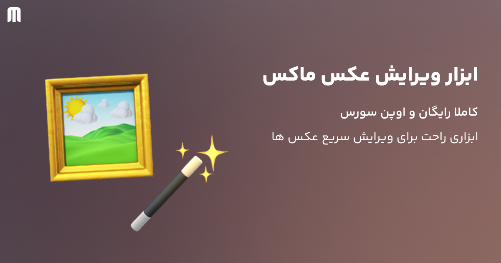

## Maux — Free Online Image Editor (Open Source)

A modern, fast, and simple image editor with a Persian (RTL) UI, built on Next.js 15, Tailwind CSS v4, and Shadcn UI. ✨

- [🖥️ Hosted Version](http:/editor.maux.site)
- Brand: “Maux” — a Persian AI platform
- About 70% of the app’s logic was authored with GPT‑5 in High Reasoning mode 🤖

---

[☕ Buy me a coffee](http://www.coffeete.ir/mirzaei_mani)

---

### Features
- 🖼️ Figma‑like canvas with pan/zoom (react-zoom-pan-pinch)
- ✂️ Advanced cropping: presets (1:1, 3:4, 4:3, 16:9, 9:16), free crop, draggable selection, corner/edge handles
- 🔁 Rotate and flip (horizontal/vertical)
- 🎚️ Adjustments: brightness, contrast, saturation
- 📥 Drag & drop + paste from clipboard
- 💾 Quick download + export to PNG / JPEG / WebP with quality control
- 📏 Pixel resize with aspect lock and cover‑fit (fills target size with smart cropping)
- 🧭 Grid background and zoom indicator
- 🖥️ Desktop‑only UX (mobile shows a notice dialog)
- 🇮🇷 Full Persian RTL interface

### Tech Stack
- Next.js 15 (App Router)
- Tailwind CSS v4
- Shadcn UI (buttons, dialog, popover, slider, etc.)
- TypeScript

### Why this project?
- Lightweight, fast, and free — perfect for everyday image edits
- Figma‑like interactions with a minimal, friendly UX
- Tailored for Persian users with a complete RTL interface

### Font (important)
The Persian font used in production (`YekanBakh`) is NOT included in this repository due to licensing. Please purchase it from FontIran and place the file at `app/fonts/YekanBakh-VF.woff2`. You can also use any alternative font.

Note: The local font is referenced in `app/layout.tsx` via `next/font/local`. If you change the font name/path, update that file accordingly.

### Development

Prereqs: Node.js 18+ and pnpm

```bash
pnpm install
pnpm dev
# open http://localhost:3000
```

### Build & Deploy

```bash
pnpm build
pnpm start
```

Deploy anywhere (e.g., Vercel). The configuration is standard.

### Roadmap
- Keyboard shortcuts (Rotate/Crop/Download)
- Undo/Redo
- Annotation tools
- More export presets


### Contributing 🤝
PRs and issues are welcome. Please follow clean TypeScript conventions (clear naming, no dead code, keep UX consistent).

### License
Open source. Respect third‑party font licenses. Use of the “Maux” brand is subject to Maux platform branding guidelines.
